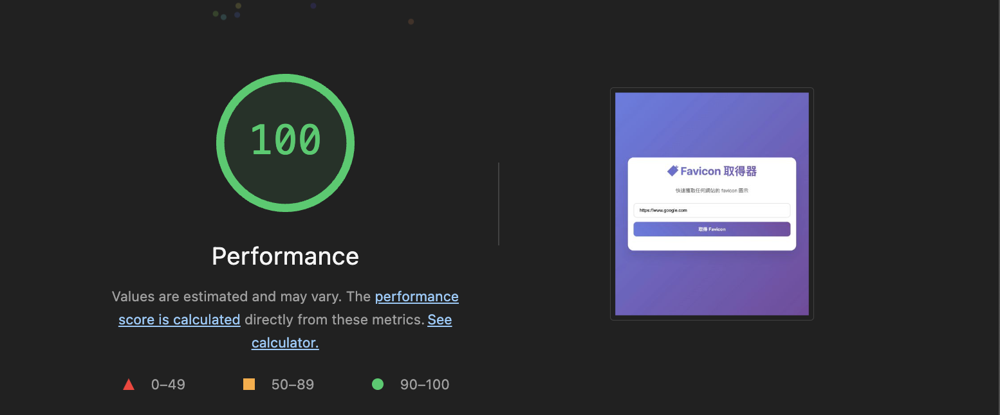

# 🔖 Favicon 取得器

> 一個以 SEO 和 Lighthouse 評分優化為目標的小型前端實驗專案

## 📖 概述

這是一個小型的前端實驗專案，以「網址尋找 Favicon」作為題材，專注於達到 **Lighthouse 100 分的 SEO 評分**。

專案的核心目標不僅是實現 Favicon 抓取功能，更重要的是探索和實踐現代前端開發的最佳標準：

- 🎯 **SEO 優化** - 達到 Lighthouse SEO 滿分
- ♿ **無障礙設計** - 符合 WCAG 標準
- 🚀 **效能優化** - 現代 CSS 和 JavaScript 技術
- 📱 **響應式設計** - 跨裝置友善體驗

## 🌐 線上展示

**Demo**: https://yo0guitarit.github.io/favicon-getter

立即體驗這個優化過的 Favicon 取得工具，感受現代 Web 標準的實踐成果。

## 🏆 專案成就



### 📊 Lighthouse 評分成果

- **🎯 SEO: 100/100** - 完美的搜尋引擎優化
- **♿ Accessibility: 100/100** - 卓越的無障礙設計
- **⚡ Performance: 優秀** - 高效能載入表現
- **🛠️ Best Practices: 現代標準** - 遵循最佳實踐

### 🎉 技術指標

- ✅ 完整的 Meta 標籤優化
- ✅ 語義化 HTML 結構
- ✅ ARIA 無障礙標籤
- ✅ 模組化 JavaScript 架構
- ✅ 現代 CSS 狀態管理

## 💎 開發價值

這個實驗專案展現了如何在小型項目中實踐**企業級的開發標準**：

### � **學習價值**

- 理解 SEO 優化的具體實施方法
- 掌握無障礙設計的實際應用
- 學習現代前端架構設計思維

### 🛠️ **實踐價值**

- 提供可複製的最佳實踐模板
- 示範關注點分離的架構設計
- 展示效能優化的具體技巧

### 📈 **商業價值**

- 提升搜尋引擎排名能力
- 擴大用戶覆蓋範圍（無障礙）
- 提高用戶體驗滿意度

## 🏗️ HTML 優化重點

### SEO 核心優化

```html
<!-- 完整的 Meta 標籤系統 -->
<meta name="description" content="免費的 Favicon 取得器工具..." />
<meta name="keywords" content="favicon, 網站圖示, icon..." />
<meta name="author" content="Favicon 取得器" />
<meta name="robots" content="index, follow" />
<link rel="canonical" href="..." />
```

### 語義化結構

```html
<!-- 清晰的語義化架構 -->
<header>
  <h1>🔖 Favicon 取得器</h1>
  <p>快速獲取任何網站的 favicon 圖示</p>
</header>
<main>
  <section class="input-section">...</section>
  <section class="status-section">...</section>
  <section class="results-section">...</section>
</main>
```

### 無障礙設計

```html
<!-- ARIA 標籤和無障礙支援 -->
<input aria-label="網站 URL 輸入欄位" required />
<div role="alert" aria-live="assertive"></div>
<div role="grid" aria-label="Favicon 結果網格"></div>
<label class="visually-hidden">網站 URL</label>
```

## 🎨 CSS 優化重點

### 現代變數系統

```css
:root {
  --primary-color: #667eea;
  --success-color: #28a745;
  --transition-normal: 0.3s ease;
  /* 統一的設計系統 */
}
```

### 狀態管理架構

```css
/* Data 屬性驅動的狀態系統 */
.container[data-state="loading"] #loading {
  display: block;
}
.container[data-state="results"] #results {
  display: block;
}

/* 按鈕狀態的視覺反饋 */
.copy-btn[data-state="success"]::after {
  content: "已複製!";
}
```

### 效能優化技術

- CSS 動畫替代 JavaScript 操作
- 減少重繪和重排
- 利用 GPU 加速的 transform
- 無障礙友善的動畫設計

## ⚡ JavaScript 優化重點

### 模組化架構設計

```
js/
├── main.js            # 主程式入口和協調
├── utils.js           # 工具函數和輔助方法
├── favicon-finder.js  # Favicon 搜尋核心邏輯
├── favicon-selector.js # 智慧選擇算法
└── ui-manager.js      # UI 狀態和互動管理
```

### 關注點分離實踐

```javascript
// ✅ JavaScript 只負責邏輯和狀態
function showLoading() {
  setAppState("loading");
}

function setButtonState(button, state) {
  button.setAttribute("data-state", state);
}
// CSS 負責所有視覺樣式和動畫
```

### 核心優化策略

- **單一職責原則**: 每個模組專注特定功能
- **依賴注入**: 減少模組間的耦合
- **狀態集中管理**: 統一的狀態更新機制
- **錯誤處理**: 完善的異常捕獲和用戶提示

## 🚀 未來參考

這個專案為未來的開發工作提供了寶貴的參考模板：

### 📋 **可複製的最佳實踐**

- SEO 優化的具體實施清單
- 無障礙設計的標準化流程
- 模組化架構的設計模式
- 效能優化的技術選型

### � **技術擴展方向**

```css
/* 未來可集成的新技術 */
@media (prefers-color-scheme: dark) {
  /* 深色模式 */
}
@container (max-width: 400px) {
  /* Container Queries */
}
.container:has(.error) {
  /* :has() 選擇器 */
}
```

### 💡 **開發哲學**

- **品質優先**: 小而美勝過大而全
- **標準驅動**: 遵循 Web 標準和最佳實踐
- **用戶中心**: 無障礙和體驗並重
- **持續優化**: 基於數據的改進方向

---

**🌟 這個專案證明了：即使是小型實驗，也能展現企業級的開發品質**
